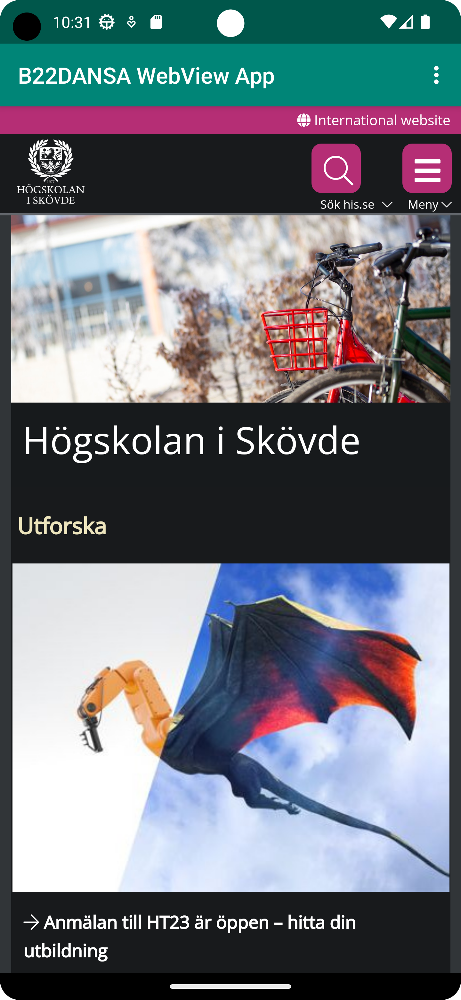
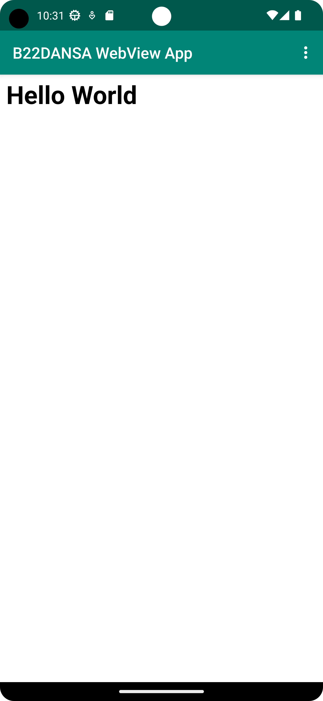

# Rapport

Uppgift 2 utgår på att lägga till WebView i appen. Det ska gå att klicka i menyn och välja från vilken källa man vill visa sidan från (external or internal).

Det första steget var att “forka” filer som ska användas som bas från GitHub och byta namn i strings.xml.

    <string name="app_name">B22DANSA WebView App</string>

Nästa steg var att tillåta internetuppkoppling för att senare ladda sidor från nätet.
Ändringar i AndroidManifest.xml

      <uses-permission android:name="android.permission.INTERNET" />

WebView element läggs till i activity_main.xml och ID

      android:id="@+id/my_webview"

För att visa upp sidor på WebView var en del kod tillagd i MainActivity.java.
I “onCreate” metod var web client skapad samt JS får tillåtelse att köras.

    public void showExternalWebPage(){
        myWebView.loadUrl("https://his.se"); // Laddar sidan från nätet
    }

    public void showInternalWebPage(){
        myWebView.loadUrl("file:///android_asset/internal.html"); // Laddar sidan från "assets" map vilken är "internal"
    }

    @Override
    protected void onCreate(Bundle savedInstanceState) {
        .....
        myWebView = findViewById(R.id.my_webview);
        myWebView.setWebViewClient(new WebViewClient());
        myWebView.getSettings().setJavaScriptEnabled(true);

När användare väljer alternativ i menyn respektive metod kommer det att köras.

     @Override
    public boolean onOptionsItemSelected(MenuItem item) {
        ....
        if (id == R.id.action_external_web) {
           ....
            showExternalWebPage();
            return true;
        }

        if (id == R.id.action_internal_web) {
            ....
            showInternalWebPage();
            return true;
        }

        return super.onOptionsItemSelected(item);
    }

Skärmdumpar:

1. External URL 

2. Internal URL 

